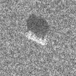
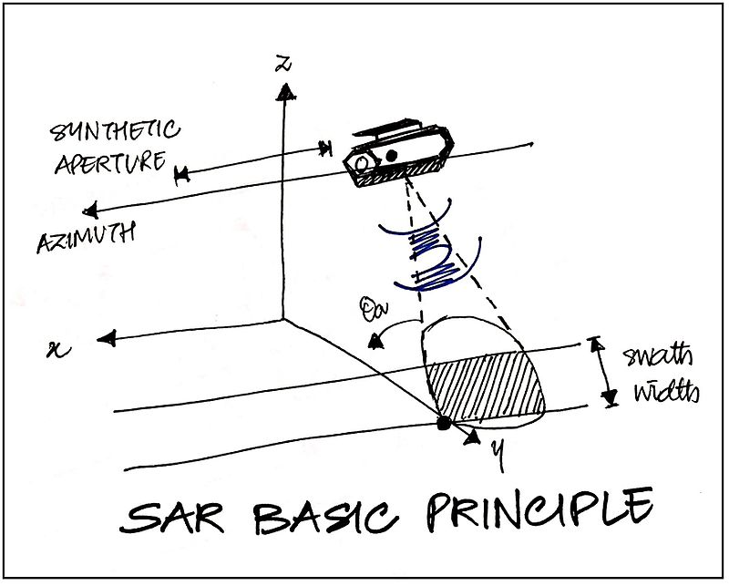
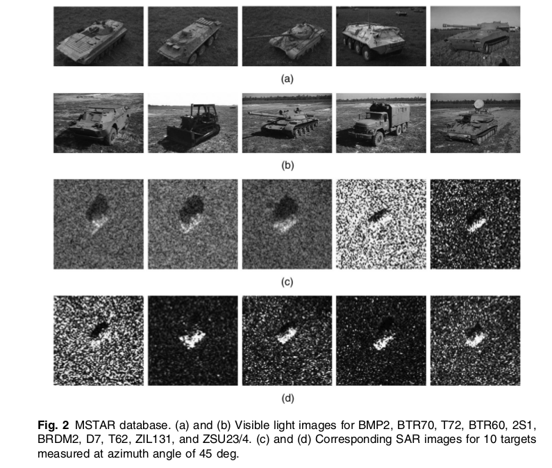
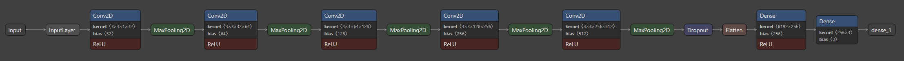
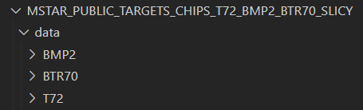
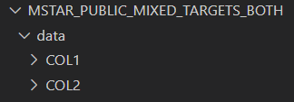
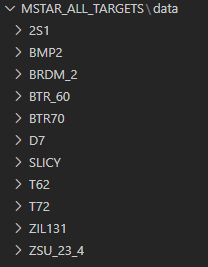

MSTAR Tensorflow

Synthetic Aperture Radar (SAR) object recognition is an important problem for automatic target recognition and aerial reconnaissance in military applications. We propose to use a deep convolutional neural network to classify and extract useful features of target chips taken from SAR image scenes. We will use the publically available Moving and Stationary Target Acquisition and Recognition (MSTAR) database as our dataset to evaluate our network.

# Introduction

We want to train a deep neural network to identify targets in the three class MSTAR dataset obtained from https://www.sdms.afrl.af.mil/index.php?collection=mstar&page=targets and possibly the ten class dataset from 
https://www.sdms.afrl.af.mil/index.php?collection=mstar&page=mixed.

Our base will be the paper *Deep convolutional neural networks for ATR from SAR imagery* [Morgan 2015], where they claim to achieve an overall 92.3% classification accuracy for the ten class problem.

We will explore a few number of different convolutional network configurations and also residual networks.

[//]: # (Also look at *APPLICATION OF DEEP LEARNING ALGORITHMS TO MSTAR DATA* [Wang, Chen, Xu, Jin 2015] where they claim 99.1% accuracy with All-ConvNets)

# Background

## SAR and MSTAR database

Synthetic Aperture Radar (SAR) is a form of radar that uses the motion of an antenna over a distance to create a large "synthetic" antenna aperture, so that it can provide much finer resolution images than standard radar.

The MSTAR dataset is a collection of SAR images gathered from 1995-1997. The two subsets we are interested in are the MSTAR Public Targets, that contains three classes of vehicles, and the MSTAR/IU Mixed Targets, that contains 10 classes of vehicles.

The images are target chips taken from scenes of SAR images, each chip is 128 by 128 pixels and contains magnitude data and phase data in the form of floating point numbers. For our purposes we only consider the magnitude data.

[//]: # (Automatic target classification of man-made objects in synthetic aperture radar images using Gabor wavelet and neural network Perumal Vasuki S. Mohamed Mansoor Roomi)

## Convolutional Networks

There are lots of tutorials on convolutional networks. Google them.

# Network

The network used is a 5-conv CNN with 3x3 filter quantity starting at 32 for the 1st convolutional layer and increasing by a factor of 2 up to 512 on for the 5th convolutional layer.
Each convolutional layer is followed by a 2x2 maxpool.
A dropout layer with factor 0.2 is used to help reduce overfitting.
Two dense layers reduce the data from size 8192 -> 256, then from 256 -> n, where n is the number of classes (either 3 or 7).

# Use Guide

For reference, this is the original repo from which this repo was forked, before modifications were made.
https://github.com/hamza-latif/MSTAR_tensorflow
## Requirements
- Python 3.x
- Python packages in requirements.txt

(GPU may not be needed, but I cannot guarantee the code will work as is, or at all without one)

- CUDA Enabled GPU. See full listing of compatible GPUs [here](https://developer.nvidia.com/cuda-gpus#compute). Only NVIDIA GPUs support CUDA.
- NVIDIA GPU driver version >= 450.80.02
- [CUDA toolkit v11.2](https://developer.nvidia.com/cuda-11.2.0-download-archive)
- [NVIDIA cuDNN SDK 8.1](https://developer.nvidia.com/cudnn)
- Minimum 16 GB of RAM

I have had inconsistent experiences with setting up for GPU use in Python, try and Google around if you have problems.
This is a helpful resource https://www.tensorflow.org/install/gpu.
If things are set up correctly, TensorFlow will automatically detect your GPU when the code is run and use it.
A collection of tests to check if TensorFlow is detecting the GPU: https://www.codegrepper.com/code-examples/python/check+if+tensorflow+is+using+gpu
## Setup and run steps
1. Download datasets for [public targets](https://www.sdms.afrl.af.mil/content/public-data/s3_scripts/index.php?file=MSTAR-PublicTargetChips-T72-BMP2-BTR70-SLICY.zip) and mixed targets ([part 1](https://www.sdms.afrl.af.mil/content/public-data/s3_scripts/index.php?file=MSTAR-PublicMixedTargets-CD1.zip) and [part 2](https://www.sdms.afrl.af.mil/content/public-data/s3_scripts/index.php?file=MSTAR-PublicMixedTargets-CD2.zip)). You will need to create an account to download.
2. Extract these folders somewhere on your system (for example, inside this repository)
3. Create a folder called "data" inside the public targets data directory.
4. Cut and paste the contents of MSTAR_PUBLIC_TARGETS_CHIPS_T72_BMP2_BTR70_SLICY\TARGETS\TEST\15_DEG and MSTAR_PUBLIC_TARGETS_CHIPS_T72_BMP2_BTR70_SLICY\TARGETS\TRAIN\17_DEG into the data folder. The structure should look like this:

5. Combine the contents of Part 1 and Part 2 downloaded for the mixed targets dataset into a single folder. Override any conflicts.
6. Create a folder called "data" inside the combined mixed targets data directory.
7. Cut and paste the contents of all of the *_DEG folders into the data folder. The structure should look like this:

8. It is also possible to combine the two datasets to create a larger one with more classes (the public targets dataset has 3 classes, while the mixed targets dataset has 7). Create a folder named "MSTAR_ALL_TARGETS" and a folder named "data" inside it.
9. Copy and paste the contents of the data folder from the public targets dataset into the data folder under the MSTAR_ALL_TARGETS folder.
10. Copy and paste the contents of the COL1/SCENE1 and COL2/SCENE1-3 into the data folder under the MSTAR_ALL_TARGETS folder. Override any conflicts. The structure should look like this (note the presence of the "data" folder on the first line):

11. Clean up any unused empty folders.
12. Run readmstar.py as a script. This will load and parse the MSTAR into large arrays and dump them into output files for later use in model training. See in-line comments for configuration prior to doing so.
13. Run mstar_network_tensorflow.py as a script. This will load the data saved by readmstar.py and train and save locally a TensorFlow model for classification. See in-line commnets for configuration prior to doing so.

Sample results and ready-to-use trained models for both the public targets and mixed targets datasets are included under the models/ folder.